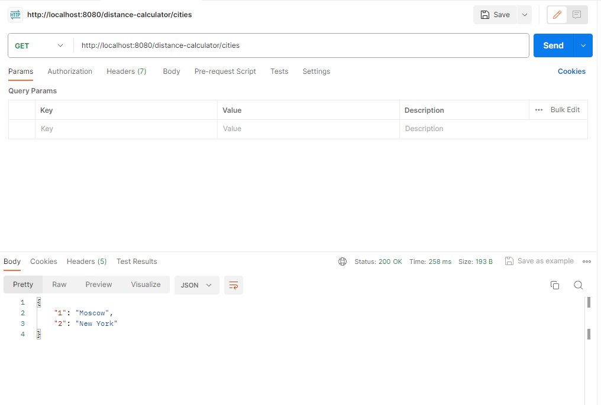
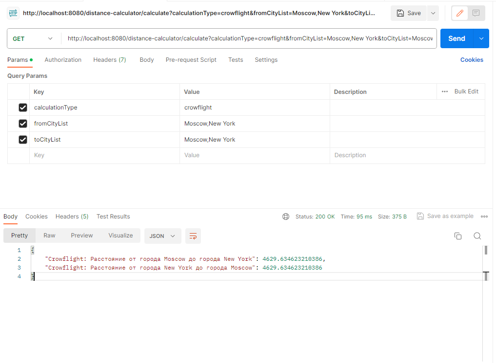
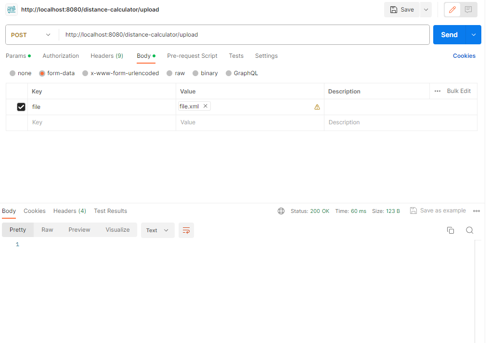

# Distance-Calculator

## REST API с 3 эндпоинтами:

| Вид запроса | URL                            | Ответ                                                                                        |
|-------------|--------------------------------|----------------------------------------------------------------------------------------------|
| GET         | /distance-calculator/cities    | Возвращает список всех городов из таблицы "city". Ответ в виде: "id города : Имя города" |
| GET         | /distance-calculator/calculate | Возвращает результат расчёта дистанции между городами                                        |
| POST        | /distance-calculator/upload    | HTTP статус 200 без тела                                                                     |

# Список технологий
1. Java 17
2. Maven 4.0.0
3. Spring Starter Web/JPA
4. Hibernate
5. MySQL
6. Liquibase
7. GIT
8. Postman (Для тестирования API)

> Также я старался писать код в соответствии с принципами SOLID и микросервисной архитектурой разработки.

# Инструкция
## 1. GET /distance-calculator/cities
### Пример

## 2. GET /distance-calculator/calculate
### **Входные данные:**
* **`calculationType`** (Тип вычисления расстояния): 
  * CrowFlight
  * Distance Matrix
  * All
* **`fromCityList`** (Список названий городов начала отсчёта)
* **`toCityList`** (Список названий городов конца отсчёта)

### **Выходные данные:**
Список всех вычисляемых расстояний в виде:

"`Тип вычисления`: Расстояние от города `fromCity` до города `toCity`: `результат`"
>**Примечание:**
> Значения переменных можно писать, игнорируя регистр.
> А вот названия всех переменных должны быть такими же, как указано выше.

### Пример

### Описание 
1. Метод вычисления **Crowflight** - вычисление расстояния по прямой между объектами, в данном случае городами.  
   Используется формула вычисления расстояния между точками на сфере.
2. Метод вычисления **Distance Matrix** - предполагается, что в таблице `distance` хранится расстояние между двумя городами по кратчайшему ***маршруту***. Соответственно результат просто берётся из таблицы `distance`.  
   Обратите внимание, что для расчёта расстояния по этому типу вычисления, должна быть соответствующая запись в таблице `distance`.

## 3. POST /distance-calculator/upload
### **Входные данные:**
* `file.xml` (XML-файл)
### **Выходные данные:**
* HTTP response code 200 without body

### **Пример**
`file.xml:`
~~~
<data>
    <Cities>
        <City>
            <name>Moscow</name>
            <latitude>46.0</latitude>
            <longitude>46.0</longitude>
        </City>
        <City>
            <name>New York</name>
            <latitude>87.0</latitude>
            <longitude>83.0</longitude>
        </City>
    </Cities>
    <Distances>
        <Distance>
            <idFromCity>1</idFromCity>
            <idToCity>2</idToCity>
            <distance>50</distance>
        </Distance>
    </Distances>
</data>
~~~

>**Примечание:**
> Прошу обратить внимание на регистры как в названии файла, так и в названиях элементов в самом файле. 
> Тут приложение очень чувствительно к регистрам.

